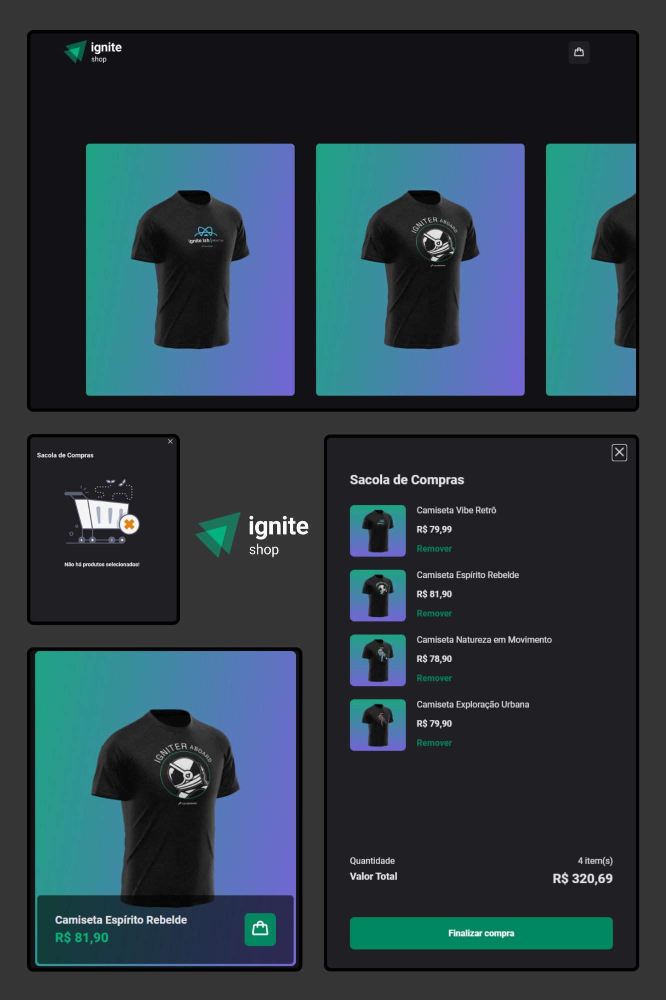

# 

**Ignite Shop** é um e-commerce de camisetas, onde os usuários podem visualizar diferentes camisetas, adicionar ao carrinho de compras e finalizar a compra de forma segura através da API do Stripe.

## 🚀 Tecnologias Utilizadas

Este projeto foi desenvolvido com as seguintes tecnologias:

- [Next.js](https://nextjs.org/) - Framework React para produção e performance otimizada.
- [Context API](https://reactjs.org/docs/context.html) - Gerenciamento de estado para compartilhar dados entre componentes.
- [Stitches](https://stitches.dev/) - Biblioteca CSS-in-JS para estilização flexível e eficiente.
- [Axios](https://axios-http.com/docs/intro) - Cliente HTTP para realizar requisições à API.
- [API do Stripe](https://stripe.com/docs/api) - API de pagamento para processar compras de forma segura.
- [Radix UI](https://www.radix-ui.com/) - Componentes acessíveis e descomplicados para construção de interfaces.
- [Keen Slider](https://keen-slider.io/) - Biblioteca para sliders responsivos e com ótima performance.

## ⚙️ Funcionalidades

- Visualização dos produtos em um carrosel de imagens.
- Visualização dos detalhes do produto.
- Adicionar produtos ao carrinho.
- Finalizar a compra via Stripe.

## 🛠️ Instalação

### 1. Clone o repositório

```bash
git clone https://github.com/seu-usuario/ignite-shop.git
```

### 2. Acesse a pasta do projeto

```bash
cd ignite-shop
```

### 3. Instale as dependências

```bash
npm install
```

### 4. Configure as variáveis de ambiente

Para configurar o Stripe e garantir que as compras possam ser processadas, é necessário criar uma conta no [Stripe](https://stripe.com/) e obter as chaves de API.

Crie um arquivo `.env.local` na raiz do projeto e adicione as seguintes variáveis:

```env
NEXT_URL="http://localhost:3000"
STRIPE_PUBLIC_KEY="sua_chave_publica_do_stripe"
STRIPE_SECRET_KEY="sua_chave_secreta_do_stripe"
```

Substitua as chaves acima pelos valores fornecidos pela sua conta Stripe.

### 5. Execute o servidor de desenvolvimento

```bash
npm run dev
```

O projeto estará disponível em `http://localhost:3000`.

## 📷 Imagens do Projeto


